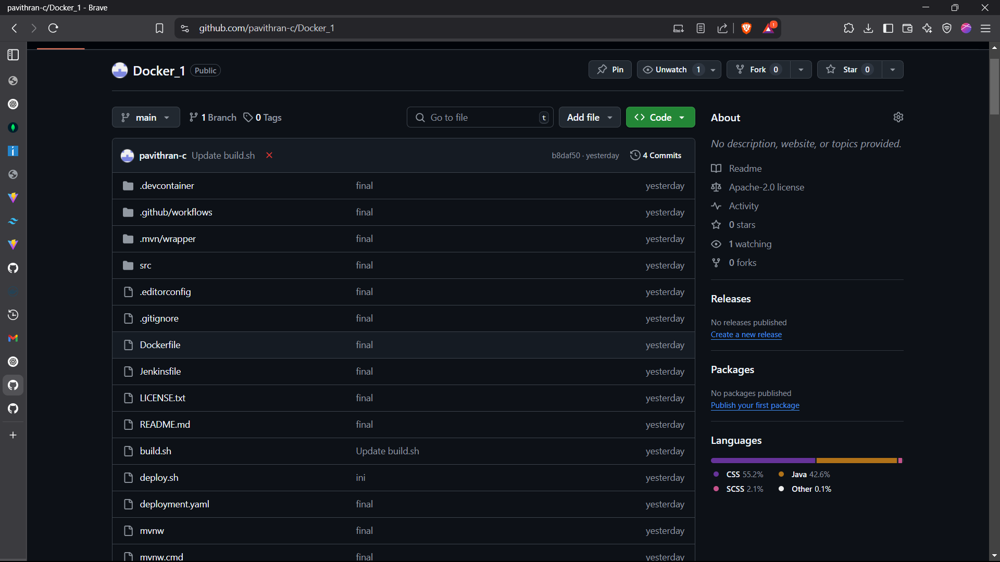

# Task 5

## Install Maven
```bash
sudo apt install maven
```


## Fork the repo on github



## Configure Jenkins
 - In Jenkins go to `configure jenkins` > `tools`
 - Locate JDK section
 - Uncheck `Install Automatically`
 - Name `Java 17`
 - Go to terminal and enter the command and get the java 17 path:

```bash
update-java-alternatives --list 
```

 - paste the java path in `JAVA_HOME`


## Fork The Repo and build the pipeline
.png>)
